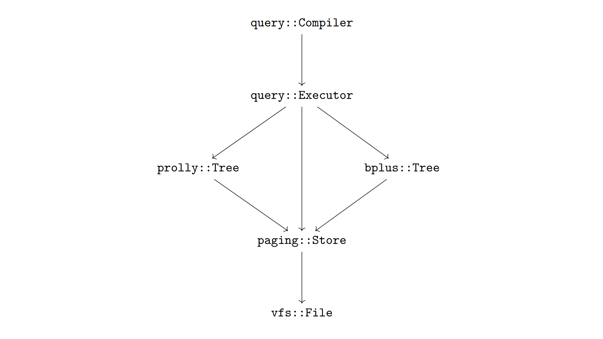

# Qinhuai database (planned)

This is my personal attempt at making a database storage engine based on Prolly trees (for primary indices) and B+ trees (for secondary indices).

## Outline (draft)

- [Database file format](doc/file_format.md)
- [Atomic commit in Qinhuai](doc/atomic_commit.md)

